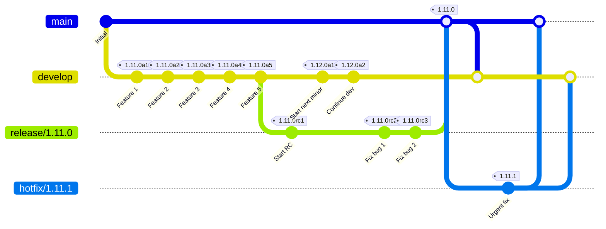
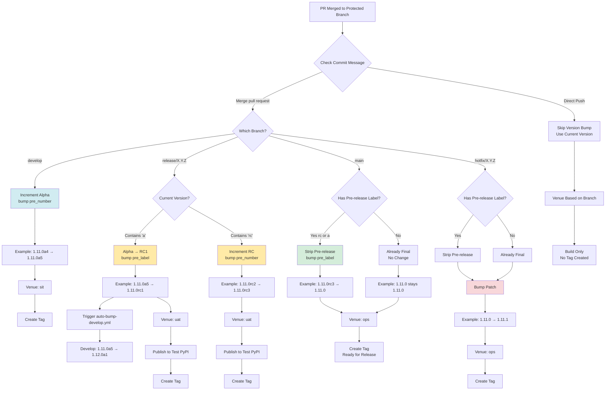
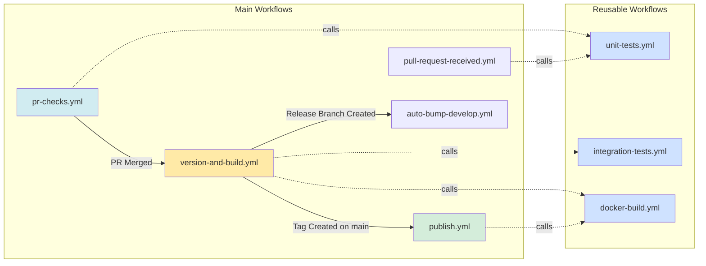
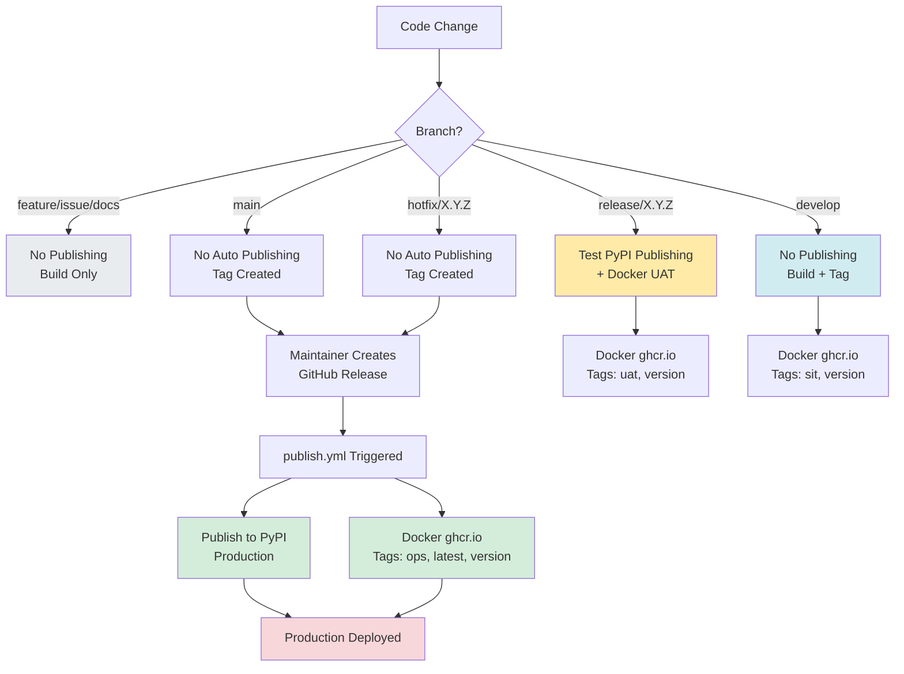
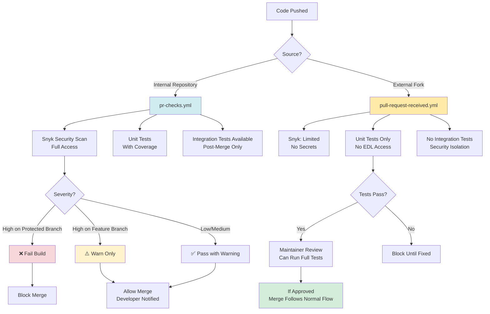
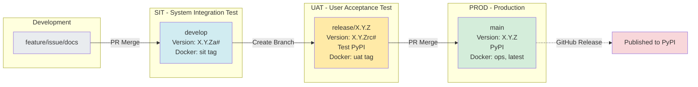

# CI/CD Architecture Diagrams

These diagrams can be rendered on GitHub, in VS Code with Mermaid extensions, or on https://mermaid.live/

---

## Complete CI/CD Flow

```mermaid
graph TB
    subgraph "Developer Workflow"
        A[Create Feature Branch] --> B[Write Code & Tests]
        B --> C[Push & Open PR]
    end

    subgraph "PR Validation - pr-checks.yml"
        C --> D{PR to Protected Branch?}
        D -->|Yes| E[Security Scan - Fail Fast]
        D -->|No| F[Security Scan - Warn Only]
        E --> G[Linting - ruff]
        F --> G
        G --> H[Type Checking - mypy]
        H --> I[Unit Tests + Coverage]
        I --> J{To develop/main/release?}
        J -->|Yes| K[Validate CHANGELOG]
        J -->|No| L[Skip CHANGELOG]
        K --> M[PR Summary]
        L --> M
    end

    M --> N{Approved?}
    N -->|No| B
    N -->|Yes| O[Merge PR]

    subgraph "Post-Merge - version-and-build.yml"
        O --> P{Is PR Merge?}
        P -->|Yes| Q[Bump Version]
        P -->|No| R[Use Current Version]
        Q --> S{Branch Type?}
        R --> S

        S -->|develop| T1[Increment Alpha<br/>1.11.0a4 → 1.11.0a5]
        S -->|release/X.Y.Z| T2{First Commit?}
        S -->|main| T3[Strip Pre-release<br/>1.11.0rc3 → 1.11.0]
        S -->|hotfix/X.Y.Z| T4[Bump Patch<br/>1.11.0 → 1.11.1]

        T2 -->|Yes| T2A[Alpha → RC1<br/>1.11.0a5 → 1.11.0rc1]
        T2 -->|No| T2B[Increment RC<br/>1.11.0rc2 → 1.11.0rc3]

        T1 --> U{Run Integration Tests?}
        T2A --> U
        T2B --> U
        T3 --> U
        T4 --> U

        U -->|develop or release| V[Integration Tests<br/>with EDL Creds]
        U -->|main or hotfix| W[Skip Integration Tests]

        V --> X[Build Python Package]
        W --> X

        X --> Y{Branch?}
        Y -->|develop/main/release| Z1[Create Git Tag]
        Y -->|hotfix| Z1
        Y -->|other| Z2[No Tag]

        Z1 --> AA{Publish?}
        Z2 --> AB[Build Complete]

        AA -->|release| AC[Publish to Test PyPI]
        AA -->|other| AD[No Publish]

        AC --> AE{Build Docker?}
        AD --> AE

        AE -->|develop or release| AF[Build & Push Docker<br/>Tags: venue + version]
        AE -->|other| AG[No Docker Build]

        AF --> AH[Update Snyk Monitor]
        AG --> AH
    end

    subgraph "Release Branch Created"
        T2A -.Triggers.-> RP[auto-bump-develop.yml]
        RP --> RQ{develop on release version?}
        RQ -->|Yes| RR[Bump develop to next minor<br/>1.11.0a5 → 1.12.0a1]
        RQ -->|No| RS[Skip - already bumped]
        RR --> RT[Push with [skip ci]]
    end

    subgraph "Production Release - publish.yml"
        AI[Maintainer Creates<br/>GitHub Release] --> AJ[Extract Version from Tag]
        AJ --> AK[Verify Tag Matches pyproject.toml]
        AK --> AL[Build Python Package]
        AL --> AM[Publish to PyPI<br/>Production]
        AM --> AN[Build & Push Docker<br/>Tags: ops, latest, version]
        AN --> AO[Update Snyk Monitor<br/>Production]
    end

    subgraph "External Contributors"
        EXT1[Fork Repository] --> EXT2[Make Changes]
        EXT2 --> EXT3[Open PR from Fork]
        EXT3 --> EXT4[pull-request-received.yml]
        EXT4 --> EXT5[Run Unit Tests Only<br/>No Secrets Access]
        EXT5 --> EXT6{Tests Pass?}
        EXT6 -->|Yes| EXT7[Maintainer Reviews]
        EXT6 -->|No| EXT2
        EXT7 --> O
    end

    style A fill:#e1f5e1
    style O fill:#fff3cd
    style AI fill:#f8d7da
    style M fill:#cfe2ff
    style Q fill:#d1ecf1
    style AM fill:#d4edda
    style V fill:#ffeaa7
    style AF fill:#74b9ff
```

---

## Branching Strategy



---

## Version Bumping Decision Tree



---

## Workflow Dependencies



---

## Publishing Strategy



---

## Security & Testing Flow



---

## Environment Progression



---

## How to Use These Diagrams

1. **View on GitHub:** These diagrams render automatically in GitHub markdown
2. **VS Code:** Install "Markdown Preview Mermaid Support" extension
3. **Online Editor:** Copy/paste to https://mermaid.live/ for editing
4. **Export:** Use mermaid-cli to export as PNG/SVG:
   ```bash
   npm install -g @mermaid-js/mermaid-cli
   mmdc -i CI_CD_ARCHITECTURE_DIAGRAM.md -o diagram.png
   ```

---

## Quick Reference Legend

| Color | Meaning |
|-------|---------|
| 🟢 Green (#d4edda) | Production/Published |
| 🟡 Yellow (#ffeaa7) | UAT/Release Candidate |
| 🔵 Blue (#d1ecf1) | SIT/Development |
| ⚪ Gray (#e9ecef) | Local/Feature Work |
| 🔴 Red (#f8d7da) | Critical/Production Impact |
| 🟠 Orange (#fff3cd) | Warning/Attention Needed |

---

**End of Diagrams**
